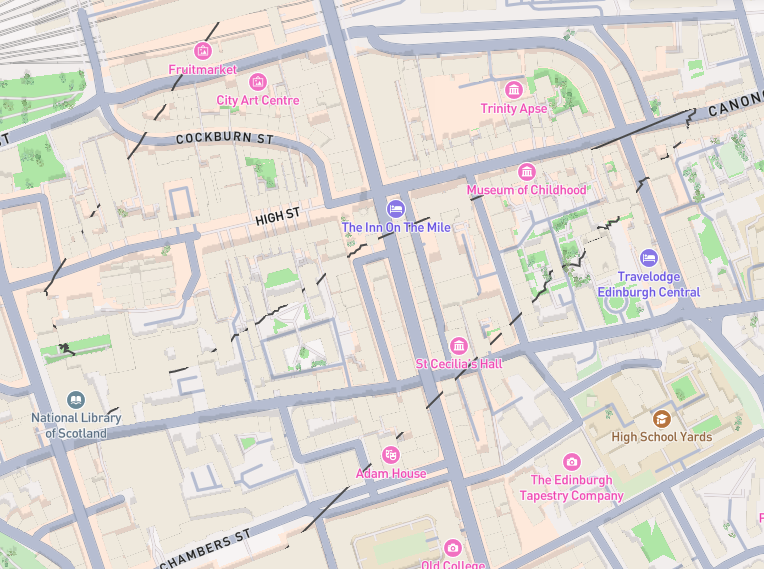

# gpsroutegen

[](https://pkg.go.dev/github.com/rrgmc/gpsroutegen)

`gpsroutegen` is a Golang package that generates realistic GPS coordinates.



## Installation

```bash
go get github.com/rrgmc/gpsroutegen
```

### Examples

```go
    data := gpsroutegen.Generate(gpsroutegen.NewPoint(55.953251, -3.188267),
        gpsroutegen.GenerateInput{
            Amount: 10,
            BearingRange: gpsroutegen.DirectionRange{
                Min: gpsroutegen.Direction_SSE,
                Max: gpsroutegen.Direction_SSW,
            },
            DistanceRange: gpsroutegen.DataRange{
                Min: 10 * 1000,
                Max: 15 * 1000,
            },
        },
        gpsroutegen.GenerateInput{
            Amount: 20,
            BearingRange: gpsroutegen.DirectionRange{
                Min: gpsroutegen.Direction_W,
                Max: gpsroutegen.Direction_WNW,
            },
            DistanceRange: gpsroutegen.DataRange{
                Min: 1000,
                Max: 1500,
            },
        },
    )

    url, err := data.ToGeoJSONIOUrl()
    if err != nil {
        panic(err)
    }
    fmt.Println("click the URL to see the route in a map")
    fmt.Println(url)
```

```go
    data := gpsroutegen.GenerateRandom(
        // WithDistance sets the total distance of the route in meters. If not set, a random value between 1000 and 2000 will be used.
        gpsroutegen.WithDistance(gpsroutegen.RandRangeInt(3000, 5000)),
        // WithAmount sets the amount of data points to generate. If not set, a value of 100 will be used.
        gpsroutegen.WithAmount(gpsroutegen.RandRangeInt(90, 150)),
        // WithDirectionChanges sets the amount of direction changes to generate. If not set, a random value between 0 and 5 will be used.
        gpsroutegen.WithDirectionChanges(gpsroutegen.RandRangeInt(6, 10)),
        // WithStart sets the starting coordinates. If not set, a random coordinate will be used.
        gpsroutegen.WithStart(gpsroutegen.RandPointNear(55.953251, -3.188267, 300.0)))

    url, err := data.ToGeoJSONIOUrl()
    if err != nil {
        panic(err)
    }
    fmt.Println("click the URL to see the route in a map")
    fmt.Println(url)
```

Output data can be tested using the [Mapbox viewer](https://geojson.io/#map=2/0/20). 

## Author

Based on [https://dev.to/daunderworks/create-gps-test-data-in-go-4of6](https://dev.to/daunderworks/create-gps-test-data-in-go-4of6).

Rangel Reale (rangelreale@gmail.com)
